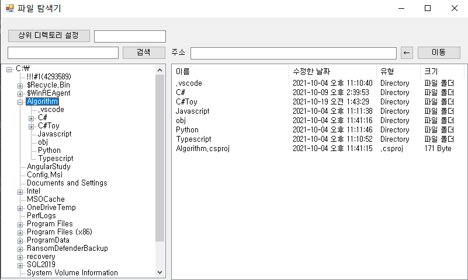
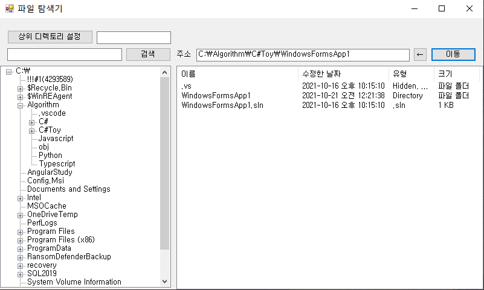
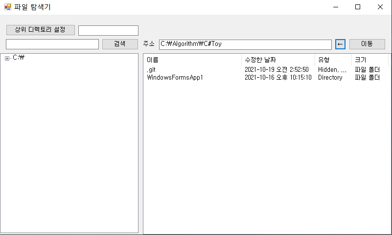
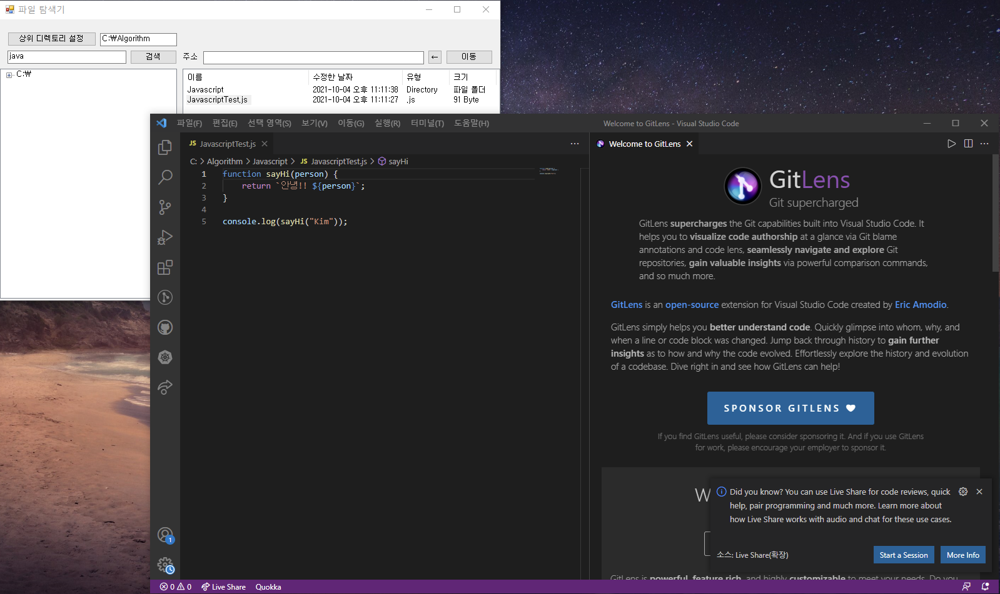
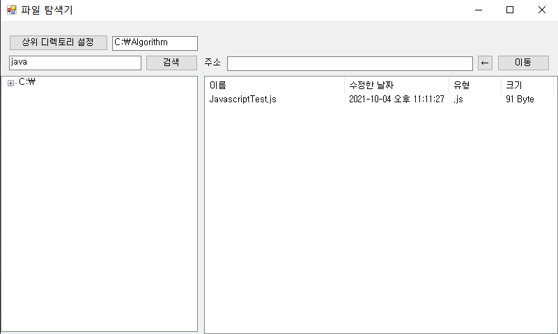

# 파일 탐색기 만들기

> 1. 기능
> 2. 실행 화면

## 1. 기능

1) TreeView의 항목을 누르면 해당 폴더 내 하위 요소를 ListView로 출력
2) 지정한 주소를 입력하면 관련 폴더 내 하위 요소를 ListView로 출력
3) ListView 내 항목을 두 번 누르면 관련 이벤트가 동작
   1) 파일은 실행되고 폴더는 하위 요소를 ListView로 출력
4) 뒤로 가기 버튼을 통해 상위 폴더로 이동
5) 주어진 디렉토리에서 검색어를 통해 해당 단어가 포함된 파일과 폴더를 ListView로 출력
   1) 3.과 마찬가지로 파일은 실행되고 폴더는 하위 요소를 ListView로 출력

## 2. 실행 화면

### (1) TreeView 탐색

### (2) 지정한 주소로 탐색

### (3) 뒤로 가기

### (4) 검색 및 파일 실행

